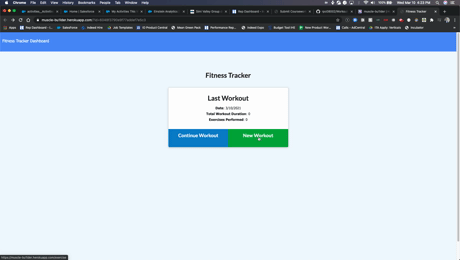

# GameTagr
The following application is a workout tracker using a Mongo database with a Mongoose schema and handle routes with Express.   

## Table of Contents

* [Installation](#Installation)
* [Usage](#Usage)
* [License](#License)
* [Badges](#Badges)
* [Contributing](#Contributing)

## Installation

* Install npm packages
* Run node server.js to run locally
* Click on Heroku Link to deploy online

## Usage
As a user, you will be able to view, create, and track daily workouts.  You can log multiple exercises in a workout on a given day.  You can track the name, type, weight, sets, reps, and duration of the exercise.  If you decide to perform cardio you will be able to track your distance traveled.

[Github Repository](https://github.com/rpc08002/Workout-Tracker)

[Live URL](https://muscle-bu1lder.herokuapp.com/)

## License

[MIT](https://choosealicense.com/licenses/mit/)

## Badges

## Contributing
* Ryan Curtin 

### Covenant Code of Conduct

This Code of Conduct is adapted from the [Contributor Covenant][homepage],
version 2.0, available at
https://www.contributor-covenant.org/version/2/0/code_of_conduct.html.

Community Impact Guidelines were inspired by [Mozilla's code of conduct
enforcement ladder](https://github.com/mozilla/diversity).

[homepage]: https://www.contributor-covenant.org